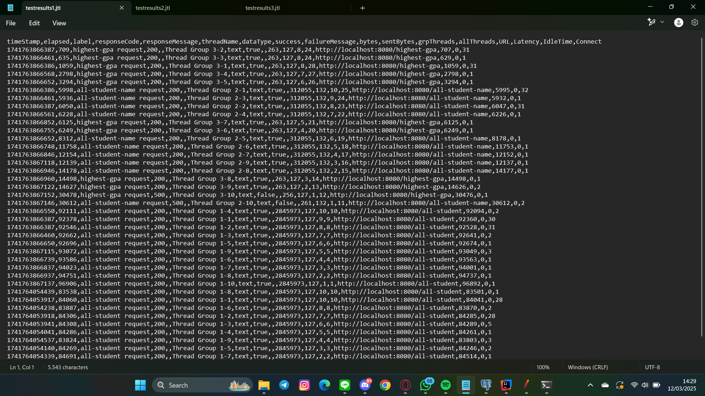
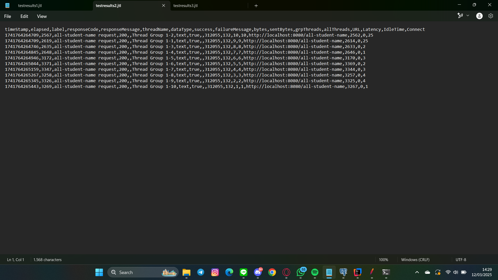
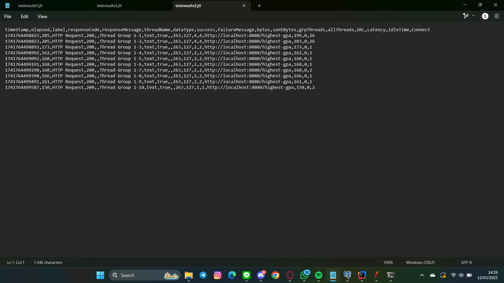

# Checkpoint question

1. Run both test plans that you have previously created (for endpoint /highest-gpa and /all-student-name) via the command line, take a
   screenshot of the results, and include them in the README.md file.

   testresult1 dengan endpoint /all-student
   

   testresult2 dengan endpoint /highest-gpa
   

   testresult1 dengan endpoint /all-student-name
   

2. After the profiling and performance optimization process is completed, perform a performance test again using JMeter, see the results,
   and compare with the first measurement. Is there an improvement from JMeter measurements? Write your conclusion in the README.md file.
   >Ya, hasilnya ada improvement. Hasil dapat terlihat di: [Sebelum Refactor](images/before-refactoring) | [Setelah Refactor](images/after-refactoring)

# Reflection

1. What is the difference between the approach of performance testing with JMeter and profiling with IntelliJ Profiler in the context of optimizing application performance?
   > JMeter digunakan untuk menguji performa aplikasi dari perspektif pengguna dengan melakukan simulasi beban dan mengukur respons
   time serta throughput. Sedangkan IntelliJ Profiler digunakan untuk menganalisis performa aplikasi dari sisi kode dengan mendeteksi
   penggunaan CPU, memori, dan eksekusi metode yang memakan waktu lama.

2. How does the profiling process help you in identifying and understanding the weak points in your application?
   > Yang saya rasakan, profiling membantu kita dengan memberikan data rinci tentang penggunaan sumber daya aplikasi, seperti metode mana
   yang paling banyak menghabiskan CPU atau bagian kode yang menyebabkan memori bocor. Hal ini memungkinkan developer untuk memahami akar
   masalah performa dengan lebih tepat dibandingkan sekadar mengamati respons dari pengujian beban.

3. Do you think IntelliJ Profiler is effective in assisting you to analyze and identify bottlenecks in your application code?
   > Ya, IntelliJ Profiler sangatlah efektif karena memungkinkan kita untuk menganalisis real-time dari proses eksekusi kode, termasuk
   call tree dan flame graph yang membantu kita melihat metode yang paling banyak menggunakan sumber daya. Dengan informasi ini,
   bottleneck dalam aplikasi bisa ditemukan dan dioptimalkan dengan lebih akurat.

4. What are the main challenges you face when conducting performance testing and profiling, and how do you overcome these challenges?
   > Karena pengguna yang akan disimulasikan banyak, waktu tunggunya akan menjadi lama. Belum lagi saya secara tidak sengaja close tab
   yang sedang meng-execute endpoint yang seharusnya seed 40000 menjadi 80000, karena saya execute ulang di tab baru. Padahal
   kode sebelumnya masih run sehingga table nya doubled. Cara saya overcome problem ini dengan menghapusnya secara manual lewat pgadmin.

5. What are the main benefits you gain from using IntelliJ Profiler for profiling your application code?
   >- Mendapatkan insight mendalam tentang penggunaan CPU, memori, dan eksekusi metode yang paling mahal.
   >- Memungkinkan debugging performa secara lebih akurat dengan visualisasi seperti flame graph dan call tree.
   >- Memudahkan mendeteksi memory leaks dan metode yang paling banyak melakukan alokasi objek.
   >- Menganalisis dampak optimasi kode secara langsung tanpa perlu pengujian ekstensif.

6. How do you handle situations where the results from profiling with IntelliJ Profiler are not entirely consistent with findings from performance testing using JMeter?
   >- Menjalankan profiling beberapa kali untuk melihat pola yang konsisten.
   >- Memeriksa apakah ada faktor eksternal seperti Garbage Collection yang mempengaruhi hasil profiling.
   >- Menganalisis perbedaan beban antara kondisi produksi dan kondisi pengujian lokal.

7. What strategies do you implement in optimizing application code after analyzing results from performance testing and profiling? How do you ensure the changes you make do not affect the application's functionality?
   > Strategi yang saya lakukan adalah menggunakan method map dalam fetching ketimbang for-loop biasa. Kemudian ada juga
   > yang menggunakan query SQL langsung pada logicnya. Saya yakin fungsionalitas aplikasinya tidak berubah karena
   > sudah diuji hasilnya pada JMeter hasilnya sama dan aplikasi juga berjalan dengan semestinya. Outputnya pun sama.
